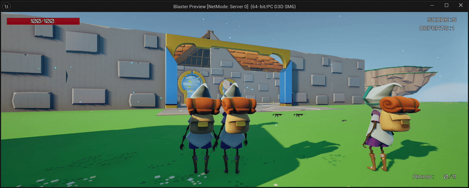
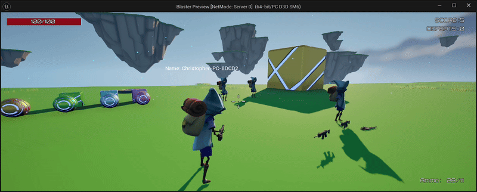
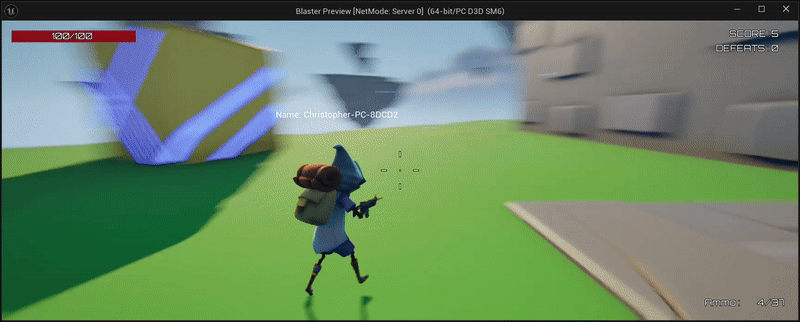

<h1 align="center">🎯 Blaster Multiplayer</h1>

  

  <strong>A networked third-person arena shooter built in Unreal Engine 5.</strong> 
  Steam sessions, server-authoritative combat, replicated match flow, weapon systems, animation, and multiplayer UI.

  
  
  
  
  

  <a href="https://www.udemy.com/course/unreal-engine-5-cpp-multiplayer-shooter/"><strong>Course Reference</strong></a>

  

Replicated weapon combat running across a multiplayer session.

## 📌 Project Snapshot

| | |
|---|---|
| **Role** | Solo learner and developer |
| **Engine** | Unreal Engine 5.5 |
| **Languages** | C++, Blueprint |
| **Focus** | Multiplayer gameplay programming and networking |
| **Development** | December 2024–present |
| **Platform** | Windows PC |
| **Status** | Course-guided project in active development |

## 🎮 Overview

*Blaster Multiplayer* is a third-person online arena shooter developed while following Stephen Ulibarri's [Unreal Engine 5 C++ Multiplayer Shooter](https://www.udemy.com/course/unreal-engine-5-cpp-multiplayer-shooter/) course.

The current implementation follows the course material and serves as a practical study of Unreal Engine's multiplayer architecture. It connects session discovery and travel, replicated character state, server-authoritative weapons and damage, match timing, scoring, elimination, respawning, animation, and UMG feedback into a playable networked loop.

This is not presented as an original game design. Independent features and design changes are planned; when added, they will be identified separately in this README and in the repository history.

## 🕹️ How to Play

Host a multiplayer session from the main menu or join an available session, collect a weapon, and eliminate opposing players to increase your score.

| Input | Action |
|---|---|
| `WASD` | Move |
| Mouse | Look |
| Left Mouse Button | Fire |
| Right Mouse Button | Aim |
| `E` | Equip a weapon |
| `R` | Reload |
| `Ctrl` | Crouch / stand |
| `Space` | Jump |

## 👨‍💻 Systems Implemented

I implemented the systems in this repository as part of the course-guided build, writing and integrating the C++, Blueprint, UI, animation, and content layers locally:

- Built a reusable multiplayer-session subsystem for creating, finding, joining, destroying, and starting online sessions.
- Connected the host/join menu to lobby travel and seamless server travel into the match map.
- Implemented replicated player movement, aiming, crouching, weapon equipping, firing, reloading, health, damage, elimination, and respawning.
- Used server RPCs, multicast RPCs, replication callbacks, and authority checks to keep combat server-authoritative and clients synchronized.
- Implemented weapon foundations and ammunition flow for assault rifle, submachine gun, pistol, rocket launcher, and shotgun variants.
- Built match-state synchronization for warm-up, active play, cooldown, restart, timers, and players who join an existing match.
- Implemented score, defeats, top-scoring-player tracking, leader display, HUD state, and elimination announcements.
- Integrated locomotion, strafing, aim offsets, leaning, turn-in-place behaviour, left-hand IK, weapon-specific animation poses, hit reactions, and reload montages.
- Added weapon pickups, projectile and casing behaviour, crosshair feedback, muzzle and impact effects, sounds, and the elimination dissolve effect.

The repository preserves the progressive development history. Course attribution applies to the current feature set; future original work will be documented explicitly rather than mixed into the course-derived scope.

## ⚙️ Technical Highlights

### Online sessions and travel

The `MultiplayerSessions` plugin wraps Unreal's Online Subsystem delegates behind a `GameInstanceSubsystem`. The menu creates and searches sessions, resolves the selected connection, and coordinates host, lobby, and match travel. The configuration currently targets Steam's public development App ID `480` for testing.

### Server-authoritative combat

Combat requests originate from the owning client and are validated through server RPCs before replicated or multicast results reach the other players. Weapon ownership, equipped state, ammunition, carried ammunition, damage, health, and elimination state use Unreal replication rules and callbacks appropriate to their audience.

### Synchronized match flow

GameMode owns authoritative warm-up, match, cooldown, scoring, and respawn rules. GameState distributes shared scoring data, while PlayerController synchronizes server time and requests the current match state when joining in progress so HUD timers and announcements remain consistent.

### Animation-driven character presentation

The animation layer derives speed, airborne and acceleration state, strafing direction, aim offsets, leaning, and turn-in-place behaviour from the replicated character. FABRIK-based left-hand placement and weapon-specific pose selection keep the character aligned with the equipped weapon.

### Extensible weapon model

A shared C++ weapon base coordinates pickup state, ownership, ammunition, fire delay, crosshairs, sounds, and effects. Projectile weapons and the shotgun specialize the firing path while remaining connected to the same combat component and replicated state.

## ✨ Current Features

- Online session hosting and discovery through Unreal's Online Subsystem.
- Lobby, seamless travel, match start, cooldown, and restart flow.
- Replicated third-person movement, aiming, crouching, firing, and reloads.
- Assault rifle, submachine gun, pistol, rocket launcher, and shotgun support.
- Server-authoritative damage, health, elimination, dissolve effect, and respawn.
- Score, defeat count, top-player tracking, timers, and announcements.
- Multiplayer HUD for health, ammunition, crosshairs, match time, and results.
- Aim offsets, strafing, leaning, turn-in-place, IK, hit reactions, and weapon montages.
- Join-in-progress match-state and server-time synchronization.

Lag compensation is a planned study topic and is **not** presented as implemented in the current repository.

## 🛠️ Technology

- Unreal Engine 5.5
- C++ and Unreal Engine Blueprints
- Unreal networking, property replication, RepNotify, server RPCs, and multicast RPCs
- Online Subsystem and Online Subsystem Steam
- Custom `GameInstanceSubsystem` plugin for multiplayer sessions
- Enhanced Input
- UMG
- Animation Blueprints, Aim Offsets, FABRIK IK, Montages, and Animation Notifies
- Niagara/particle, material, audio, and projectile effects
- Git LFS for Unreal and binary assets

## 🎬 Media

  

Creating and joining a multiplayer session from the main menu.

  

Elimination, respawn flow, and replicated score feedback.

A focused YouTube gameplay showcase will be added after the next stable gameplay pass.

## 🚀 Running the Project

### Unreal Engine project

1. Install Unreal Engine **5.5** and a compatible Visual Studio C++ toolchain on Windows.
2. Install [Git LFS](https://git-lfs.com/), then clone this repository normally.
3. Right-click `Blaster.uproject` and generate the Visual Studio project files if required.
4. Build the `BlasterEditor` target and open `Blaster.uproject`.
5. Run multiple editor clients for local multiplayer testing, or use separate Steam accounts and machines when testing the Steam session flow.

Generated folders such as `Binaries`, `Intermediate`, `Saved`, and `DerivedDataCache` are intentionally excluded and will be recreated by Unreal Engine. A tested Windows build will be published through GitHub Releases when the current development pass is ready.

## 🧭 Project Context and Roadmap

- **Context:** Independent course-guided learning project
- **Course:** [Unreal Engine 5 C++ Multiplayer Shooter](https://www.udemy.com/course/unreal-engine-5-cpp-multiplayer-shooter/)
- **Instructor:** [Stephen Ulibarri](https://www.udemy.com/user/stephen-ulibarri-3/)
- **Repository history:** Progressive implementation history preserved; later portfolio-migration changes identified separately
- **Next milestone:** Complete the remaining course systems, then add clearly documented original mechanics and presentation improvements

Planned work includes completing the networking study topics, producing a stable packaged build, recording a concise multiplayer showcase, and introducing original features that distinguish the project from the course baseline.

## 👥 Credits, Ownership and Status

The current project was implemented by Christopher Bonetto by following Stephen Ulibarri's course named above. The course's teaching material and design belong to their respective author; third-party Unreal Marketplace and sample assets remain the property of their respective creators.

> This repository is shared for portfolio review and educational demonstration. It does not grant permission to redistribute course material or third-party assets, and it is not presented as an open-source release.

**Project status:** In active development; current version is course-guided and original extensions are planned.

## 💼 Contact

[LinkedIn — Christopher Bonetto](https://www.linkedin.com/in/christopher-bonetto-547876221)
